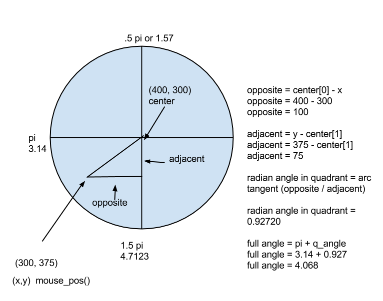

#Virtual Controller Angle Tutorial

The [code is on GitHub](https://github.com/codetricity/virtual-controller).

Divide the virtual controller into four quadrants.

For each quadrant, you'll need to be adjust the formula to
calculate the opposite and adjacent sides of the triangle.  For example, if the mouse
is above the center of the controller, you'll need to subtract the mouse y position
from the centery of the controller. The formulas for each quadrant are slightly 
different, depending on whether you add or subtract values to get the length of
the side of the triangle. 

For the y-axis, the mouse point is either:

1. above the center of the controller
2. below the center of the controller
3. at the same height of the center of the controller

## Mouse Point Located Above Controller Center

If the mouse point is above the center of the controller, than check for one of three conditions:

1. x is to the right of the controller
2. x is to the left of the controller
3. x is at the same point as the centerx of the controller

### Mouse point is located above and to the right of controller (Quadrant 1)

Example code.  Note that you need to convert to floating point.  
center is a two number tuple (400,300), the center of the player.  x, y is the mouse position.

        opposite = float(center[1] - y)
        if x > center[0]:
            adjacent = float(x - center[0])
            rad = math.atan(opposite/adjacent)
            

Here's what it looks like with the game running.  Note that the angle of the mouse 
pointer relative to the center of the virtual controller is the same as the angle of
the beam relative to the center of the player.

---

---

## Mouse point is below and to the left of the controller center (Quadrant 3)

If the mouse pointer is not in quadrant 1, add the appropriate radian value.  For example,
if the mouse pointer is in quadrant 3, then add pi (3.14) to the radian value.

