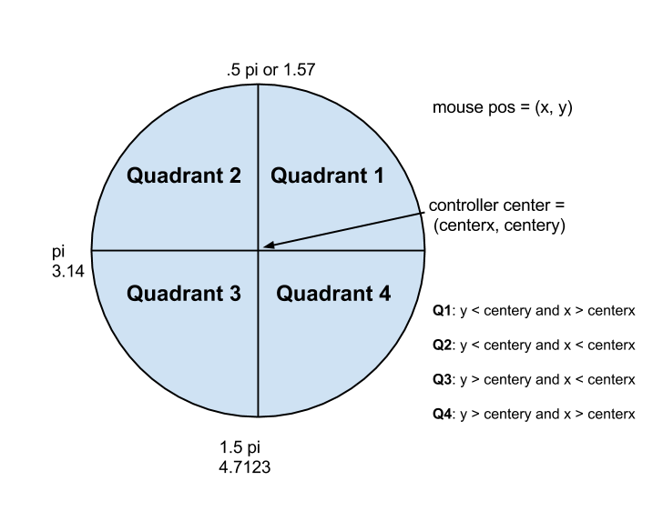
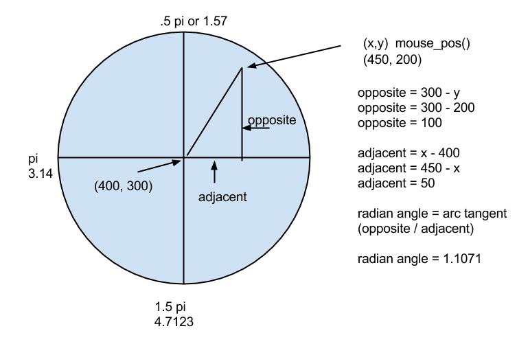
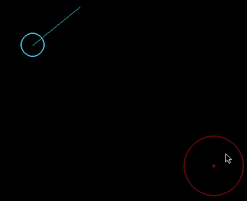
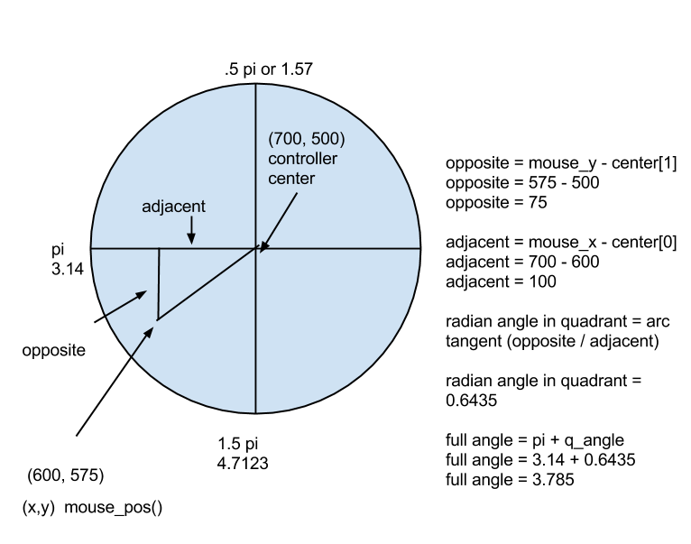

#Virtual Controller Angle Tutorial

This is part of an educational curriculum to teach 9th and 10th 
grade students how to build mobile games on Android.  The student
needs to be familiar with trigonometry.  The primary target student
is in 10th grade.

The [code is on GitHub](https://github.com/codetricity/virtual-controller).

There are two examples.  The main lesson is in main.py and focuses on 
the getting the angle from the virtual controller.  The second lesson
is in bullet.py and shows how to fire bullets from a moving player. 
There is sound generated each time a bullet is fired.

Additional sounds can be downloaded from [SoundBible](http://soundbible.com).

Since the player is moving, I also implemented a rudimentary bounds detection
so that the player doesn't move off the screen.

## Create the Controller

In this lesson, the controller is a circle of radius 50.  The main
objective is to calculate the angle of the player's right thumb in
relation to the center of the circle.  Since we're running this
on a desktop computer before loading it onto an Android phone, 
the mouse will represent the point the
thumb touches the screen.

     pygame.draw.circle(SCREEN, RED, v_control.center, 50, 2)
     pygame.draw.circle(SCREEN, RED, v_control.center, 3)
  
There is a rectangle called, v_control that I'm using with
colliderect.

     v_control = pygame.Rect(650, 450, 100, 100)

Before I calculate the angle, I make sure that the thumb is inside
of the rectangle for the virtual controller. 

    if v_control.collidepoint(pos):
        rad = get_angle(pos, v_control.center)

## Review Your Trigonometry
You'll need to use arc tangent to calculate the angle
in radians.  You'll also need to use sine and cosine.  If your
trigonometry is a rusty, review it now.

`math.atan`, `math.sin`, and `math.cos` are in the python math 
standard library.  You'll
need to add `import math` at the top of your program.  
To use arc tangent you'll need to calculate the lengths of the
opposite and adjacent sides of a right triangle. Since the 
formulas to calculate the lengths of the sides of a triangle 
 are slightly different depending on where the thumb is on the controller, 
 I've divided the controller into
 four quadrants, starting with quadrant one in the upper right and 
 rotating counter-clockwise.

For each quadrant, you'll need to adjust the formula to
calculate the opposite and adjacent sides of the triangle.  For example, if the mouse
is above the center of the controller, you'll need to subtract the mouse y position
from the centery of the controller. 

## Define Each Quadrant

For the y-axis, the mouse point is either:

1. above the center of the controller
2. below the center of the controller
3. at the same height of the center of the controller

##Quandrants 1 and 2 

**Mouse Point Located Above Controller Center**

If the mouse point is above the center of the controller, than check for one of three conditions:

1. x is to the right of the controller
2. x is to the left of the controller
3. x is at the same point as the centerx of the controller

###Quadrant 1 

**Mouse point is located above and to the right of controller**

Example code.  Note that you need to convert to floating point.  
center is a two number tuple (400,300), the center of the player.  x, y is the mouse position.

        opposite = float(center[1] - y)
        if x > center[0]:
            adjacent = float(x - center[0])
            rad = math.atan(opposite/adjacent)
            

Here's what it looks like with the game running.  Note that the angle of the mouse 
pointer relative to the center of the virtual controller is the same as the angle of
the beam relative to the center of the player.

---

---

##Quadrant 3 

**Mouse point is below and to the left of the controller center** 

If the mouse pointer is not in quadrant 1, add the appropriate radian value.  For example,
if the mouse pointer is in quadrant 3, then add pi (3.14) to the radian value.

##Using Radian Angle to Control Beam

Creating a beam is easier than a bullet.  It is a line with the starting
point at the center of the player and the end point 30 pixels out from 
the center.

Once you have the angle, use sine and cosine to calculate the length of 
opposite and adjacent sides of the triangle.

    def beam(angle, center):
        """
        :param angle: radians calculated from the virtual controller
        :return: x,y coordinates of the end-point
        Start with the center of the player.  The end of the beam is 100 pixels
        away from the center.  To make a bullet instead of beam, create a class
        for bullet and have the hypoteneuse be an attribute that increases
        in size.  Remember to delete the bullet from the sprite group or list
        when it goes off the screen.
        """
        hypoteneuse = 30.0
        adjacent = math.cos(angle) * hypoteneuse
        x = adjacent + center[0]
        opposite = math.sin(angle) * hypoteneuse
        y = center[1] - opposite
        beam_end = (x, y)
        return beam_end

##Shoot Bullets Instead of a Beam

If you want to shoot bullets, I'm using sprites.  Don't be intimidated
by sprites even though the code looks a bit funky.  The bullet moves
forward by increasing the length of the hypotenuse by 5 pixels.

    class Bullet(pygame.sprite.Sprite):
        def __init__(self, angle, p_pos):
            YELLOW = (250, 223, 65)
            RED = (200, 10, 10)
            pygame.sprite.Sprite.__init__(self)
            self.image = pygame.Surface((6,6))
            pygame.draw.circle(self.image, YELLOW, (3, 3), 3)
            pygame.draw.circle(self.image, RED, (3,3), 1)
            self.rect = self.image.get_rect()
            self.hypotenuse = 30.0
            self.angle = angle
            self.cent = p_pos
    
        def update(self):
            adjacent = math.cos(self.angle) * self.hypotenuse
            x = adjacent + self.cent[0]
            opposite = math.sin(self.angle) * self.hypotenuse
            y = self.cent[1] - opposite
            self.rect.center = (x, y)
            self.hypotenuse += 5

##Move The Player
In the second example, I'm using almost the same code to move the 
player around the screen.

[Additional examples are available](https://github.com/codetricity/pychildren-demos)

The most likely scenario is to start with [Swarm](https://github.com/codetricity/pychildren-demos/tree/master/Swarm) 
and build from there.

My son is planning to try something with the [Android accelerometer](http://pychildren.blogspot.com/2014/10/using-android-accelerometer-with-pygame.html).
